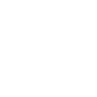

<!-- PROJECT SHIELDS -->
<!--
*** I'm using markdown "reference style" links for readability.
*** Reference links are enclosed in brackets [ ] instead of parentheses ( ).
*** See the bottom of this document for the declaration of the reference variables
*** for contributors-url, forks-url, etc. This is an optional, concise syntax you may use.
*** https://www.markdownguide.org/basic-syntax/#reference-style-links
-->
<!-- Place this tag where you want the button to render. -->
<!-- Place this tag where you want the button to render. -->

<!-- PROJECT LOGO -->
 

  

  <h3 align="center">KRNL-UI</h3>

  

    The first KRNL Synapse X UI!
     
    <a href="#about-the-project"><strong>Explore the docs »</strong></a>
     
     
    <a href="https://github.com/P-DennyGamingYT/KRNL-UI/releases/">Download</a>
    ·
    <a href="https://github.com/P-DennyGamingYT/KRNL-UI/issues">Report a Bug</a>
    ·
    <a href="mailto:paysonholmes@gmail.com">Request Feature</a>
  

<!-- TABLE OF CONTENTS -->

  
Table of Contents

  <ol>
    <li>
      <a href="#about-the-project">About The Project</a>
    </li>
    <li><a href="#installation">Installation</a></li>
    <li><a href="#contact">Contact</a></li>
    <li><a href="#acknowledgments">Acknowledgments</a></li>
  </ol>

<!-- ABOUT THE PROJECT -->
## About The Project

The KRNL UI is a fully custom UI for Synapse X. If you just want to use the KRNL UI but with the functionality of Synapse X, or just like the KRNL UI better, this UI is for you. First off this UI compares to no other UI. This is the official UI from KRNL, the best free roblox exploit. Before people switched to Synapse, they use KRNL. A lot of them got used to the KRNL UI and the Synapse UI was just too different. So I created the KRNL UI, fit for everyone, everything, all the time. I plan on adding in more features in the future such as dark mode and light mode, a settings menu packed with options and much more.

(<a href="#top">back to top</a>)

<!-- USAGE EXAMPLES -->
## Installation

If the UI is not used or set up correctly it will not work, so follow these steps in order to correctly install the KRNL UI.

1. Go to the [Releases](https://github.com/P-DennyGamingYT/KRNL-UI/) tab and download the latest version of the KRNL UI.
2. Extract that folder into your Synapse X folder.
3. Run krnlss.exe and the UI should open.
4. Join a game of roblox.
5. Inject and the Execute!

(<a href="#top">Back To Top</a>)

<!-- CONTACT -->
## Contact

Payson Holmes - [Discord](https://discord.io/PDennSploit/) - pdennsploit@gmail.com

Project Link: [https://github.com/P-DennyGamingYT/KRNL-UI/](https://github.com/P-DennyGamingYT/KRNL-UI/)

(<a href="#top">Back To Top</a>)

<!-- ACKNOWLEDGMENTS -->
## Acknowledgments

Thank you for reading the KRNL UI for Synapse X Documentation, I would like to go over a few acknowledgments.

1. [Stack Overflow](https://stackoverflow.com/) has been a huge help during the process of making this UI as it is very, very annoying to fix errors yourself and I want to thank everybody on their that helped me get through my errors.

2. [Microsoft Docs](https://docs.microsoft.com/en-us/) has also been a huge help as I have been reading about what causes the errors I was having and trying to reverse that without losing a feature on the UI.

3. I just want to thank the community for supporting me during the development of this UI and it has been a great help. Those of you who helped me test out the earlier versions and BETA versions to get the colors and stuff just right, thank you.

## Credits

[[YT]P-Denny#7313](https://discord.com/user/820680923887566868) - UI and Backend

(<a href="#top">Back To Top</a>)

